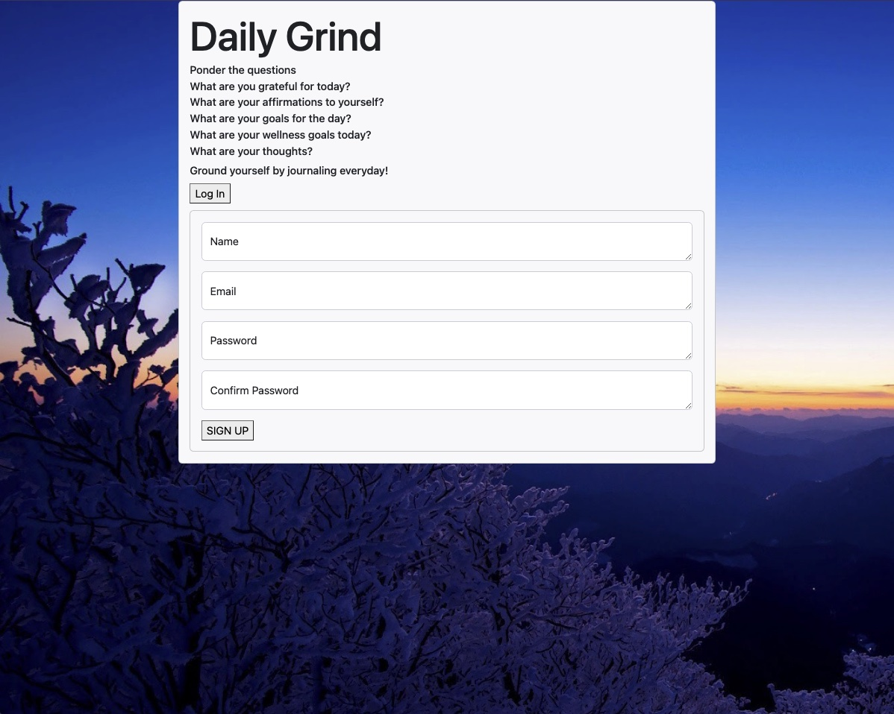
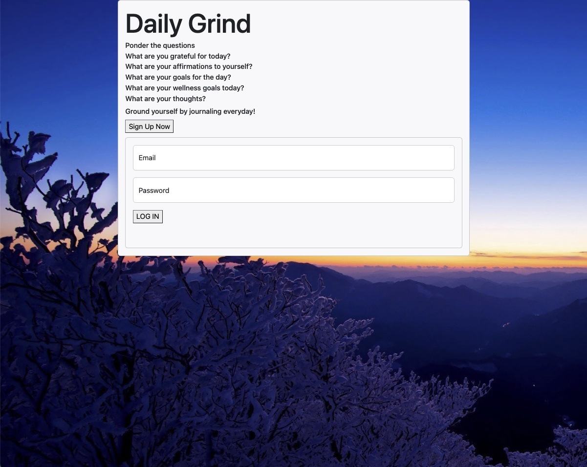
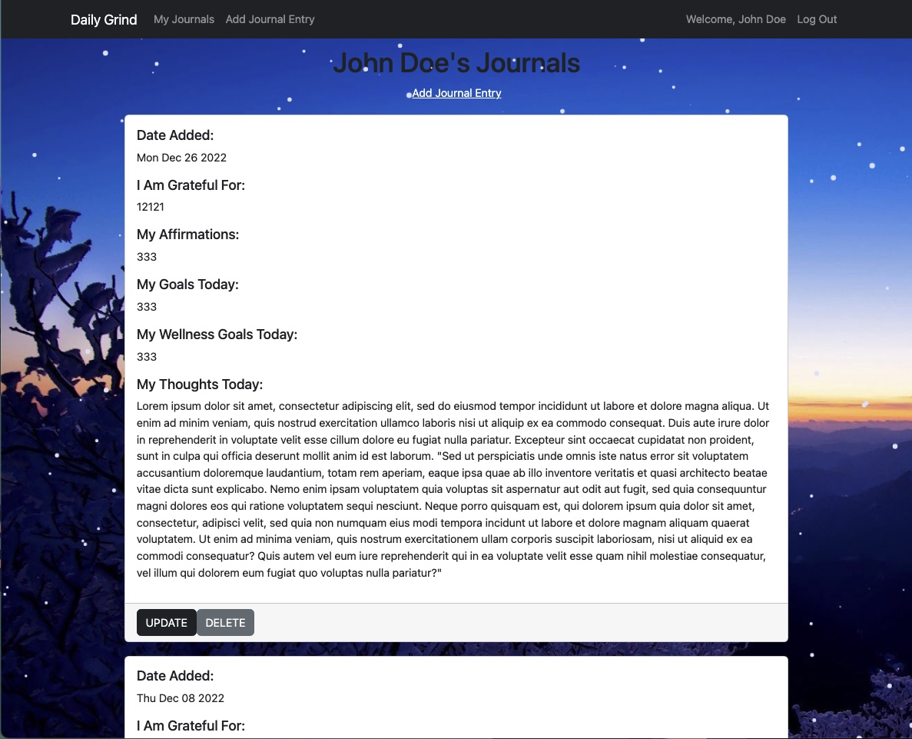
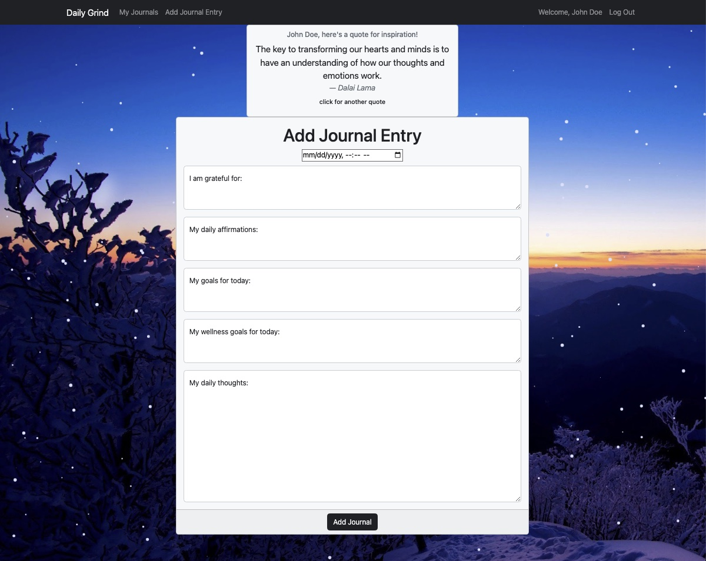
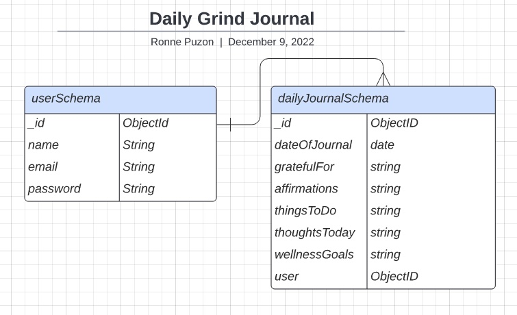

 # **Daily Grind**
 
 ### ***Use this app to ground yourself - start each day by writing what you are grateful for, your daily affirmations, your daily goals, your daily thoughts and daily wellness goals***
&nbsp;
## **Screenshots:**

### Sign Up Page ###

&nbsp;

### Login Page ###

&nbsp;

### My Journals ###

&nbsp;

### Add Journal Entry - also displays random quote on top of page using API to help inspire user ###

&nbsp;

## **ERD Diagram:**

&nbsp;

 

## **Trello Board:**

**https://trello.com/b/VtZ2XB3g/daily-grind** 

## **Technologies Used:**
- HTML
- CSS
- Javascript
- MongoDB
- Mongoose
- Express.JS
- React.JS
- React Bootstrap
- JWT
- Quotable Api (random quote generator - https://github.com/lukePeavey/quotable )
- React Snowfall

&nbsp;
## **Next Steps:**
&nbsp;
Future Enhancements will include: 
- Goal checklist that aggregates all goals entered and allows user to check this off
- Ability to filter display of users journals

